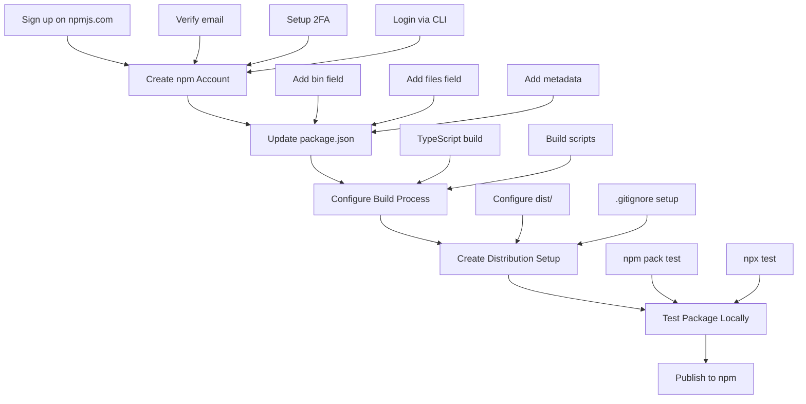

# Publishing Guide for MHW Helper MCP Server

This document outlines the process for publishing the MHW Helper MCP Server to npm.

## Publishing Flow



## Detailed Steps

### 1. Create npm Account

- Visit https://www.npmjs.com/signup
- Create a new account with:
  - Username
  - Email address
  - Password (use a strong password)
- Verify email address by clicking the link sent to your email
- Set up two-factor authentication (2FA)
  - Strongly recommended for package publishing
  - Can use authenticator app or SMS
- Log in via npm CLI using:
  ```bash
  npm login
  ```

### 2. Update package.json

The following updates will be made to package.json:

- Add `bin` field to make the package executable via npx
- Add `files` field to control which files get published
- Add metadata:
  - keywords
  - repository
  - author
  - license
  - bugs
  - homepage

### 3. Configure Build Process

- Verify TypeScript configuration in tsconfig.json
- Add necessary build scripts:
  ```json
  {
    "scripts": {
      "build": "tsc",
      "prepare": "npm run build",
      "prepublishOnly": "npm test",
      "clean": "rm -rf dist"
    }
  }
  ```

### 4. Create Distribution Setup

- Configure dist/ directory:
  - Ensure it's in .gitignore
  - But will be published to npm
- Set up proper file structure:
  - Source in src/
  - Built files in dist/
  - Types in types/
- Update .gitignore:
  ```
  dist/
  node_modules/
  *.log
  ```

### 5. Test Package Locally

Before publishing:

1. Run local build:
   ```bash
   npm run build
   ```
2. Test with npm pack:
   ```bash
   npm pack
   ```
3. Test local installation:
   ```bash
   npm install -g .
   ```
4. Test npx execution:
   ```bash
   npx .
   ```

### 6. Publish to npm

Once everything is tested:

1. Login to npm:
   ```bash
   npm login
   ```
2. Publish the package:
   ```bash
   npm publish
   ```
3. Verify the package is published:
   ```bash
   npm view mhw-mcp-server
   ```
4. Test global installation:
   ```bash
   npx mhw-mcp-server
   ```

## Post-Publishing

After successful publication:

1. Tag the release in git
2. Update documentation with installation instructions
3. Test the package in a new directory
4. Monitor the package on npm dashboard

## Maintenance

For future updates:

1. Update version in package.json
2. Make changes
3. Run tests
4. Build
5. Publish with `npm publish`
